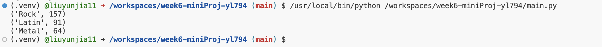

# Week6 Mini project
In this project, I import a sample database for sqlite and write a complex query for it. The Chinook database contains information about a fictional digital media store, including tables for artists, albums, media tracks, invoices, and customers.

# Query
The query is stored in query.sql file.
```
WITH USA_Tracks_Sold AS 
(
    SELECT il.* FROM InvoiceLine il
    JOIN Invoice i on il.InvoiceId = i.InvoiceId
    JOIN Customer c on i.CustomerId = c.CustomerId
    WHERE c.Country = 'USA'
)

SELECT
    g.Name as Genre,
    COUNT(uts.InvoiceLineId) as Tracks_Sold
FROM USA_Tracks_Sold uts
JOIN Track t on uts.TrackId = t.TrackId
JOIN Genre g on t.GenreId = g.GenreId
GROUP BY 1
ORDER BY 2 DESC
LIMIT 3;
```
# Explanation
1. WITH Clause:
We begin by creating a Common Table Expression (CTE) named USA_Tracks_Sold. This will store the details of all the tracks that were sold in the USA.
We join the InvoiceLine, Invoice, and Customer tables based on appropriate foreign keys.
We filter the results to only include sales from customers in the USA using the condition WHERE c.Country = 'USA'.

2. Main Query:
We then proceed with the main query which will operate on our CTE.
We join our CTE (USA_Tracks_Sold) with the Track table to get track details and then with the Genre table to get the genre name.
We use GROUP BY 1 to group by the first column in our SELECT statement (i.e., Genre).
We count the number of tracks sold per genre using COUNT(uts.InvoiceLineId).
The results are ordered in descending order of the Tracks_Sold count using ORDER BY 2 DESC (2 refers to the second column in our SELECT clause).
Finally, we use LIMIT 3 to only get the top 3 genres.

The result of this query will be the top 3 genres that have the highest track sales in the USA.

# Result
